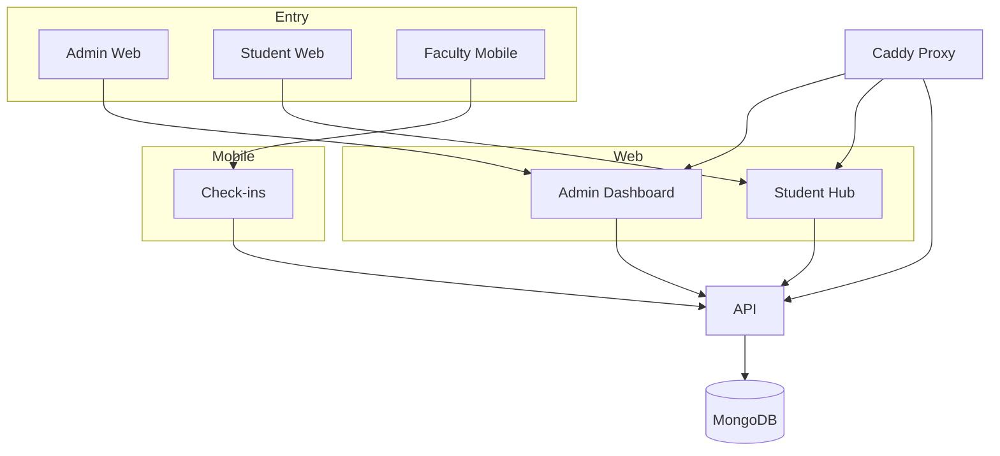
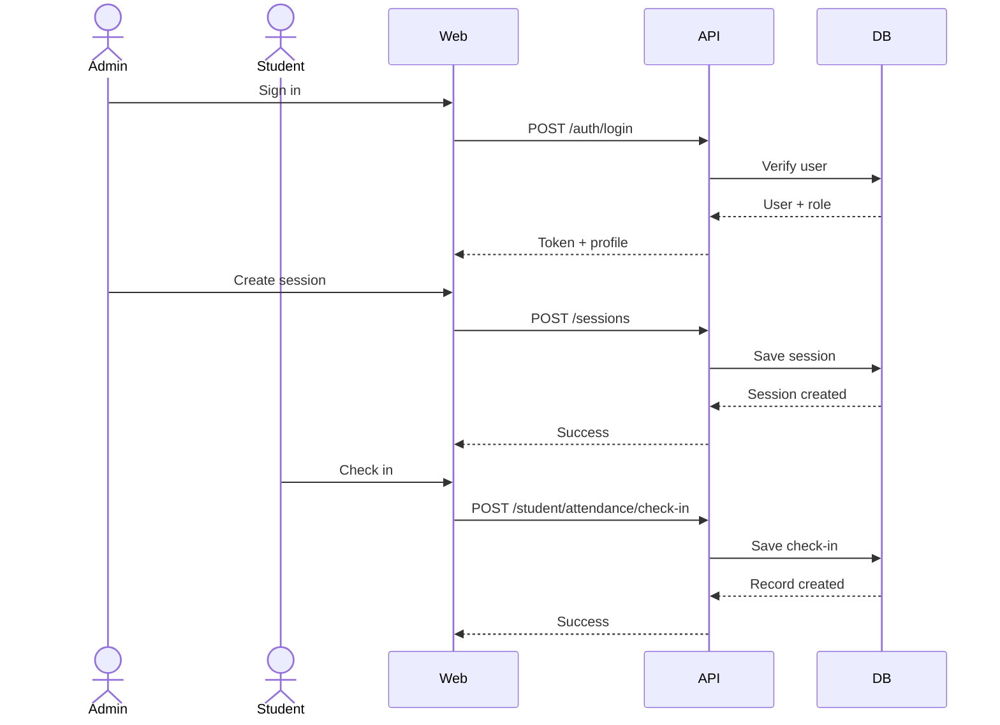
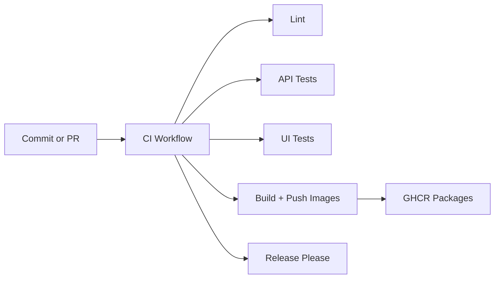

# Vibhaag (Rebuild)

A modern college attendance, analytics, and timetable platform on the MERN stack, with a React Native companion app for faculty check-ins.

## Stack

- Web: React + Vite + TypeScript
- API: Node (Bun runtime) + Express + MongoDB + TypeScript
- Mobile: React Native (Expo)
- Infra: Docker Compose

## Quickstart (Docker Compose)

```bash
docker compose up --build
```

Seed sample data (run after containers are up):

```bash
docker compose exec api bun src/seed.ts
```

Open:

- Web (direct): <http://localhost:5173>
- API (direct): <http://localhost:4000/health>
- Web (proxy): <http://vibhaag.localhost>
- API (proxy): <http://api.vibhaag.localhost/health>
- API Docs (Swagger): <http://api.vibhaag.localhost/docs/>

Seeded credentials (demo logins):

- Admin: <admin@vibhaag.dev> / admin123
- Faculty: <rhea@vibhaag.dev> / faculty123
- Faculty: <arjun@vibhaag.dev> / faculty123
- Faculty: <nisha@vibhaag.dev> / faculty123
- Student: <ira@vibhaag.dev> / student123
- Student: <meera@vibhaag.dev> / student123

## UX Structure



## Developer Architecture

```mermaid
flowchart LR
  Web[apps/web (React + Vite)]
  API[apps/api (Bun + Express)]
  Mobile[apps/mobile (Expo)]
  Shared[packages/shared]
  Mongo[(MongoDB)]
  Caddy[Caddy Proxy]

  Web --> Shared
  API --> Shared
  Mobile --> Shared
  Web --> API
  Mobile --> API
  API --> Mongo
  Caddy --> Web
  Caddy --> API
```

## User Journeys



## Demo Walkthrough (Docker)

- Step 1: Start the stack

```bash
docker compose up --build -d
```

- Step 2: First-time setup (choose one)
  - Quick demo data

```bash
docker compose exec api bun src/seed.ts
```

- Fresh school setup
  - Open <http://vibhaag.localhost> (or <http://localhost:5173>)
  - Create the first admin account (bootstrap screen)
- Step 3: Log in to the web app at <http://localhost:5173>
  - Use `admin@vibhaag.dev` / `admin123` if seeded
- Step 4: Explore
  - Overview: attendance rate + sessions summary
  - Attendance: check in to a session and refresh recent activity
  - Timetable: seeded sessions are visible
  - Engagement: publish announcements, review leave requests, read feedback

If you want to re-seed from scratch, re-run the seed command. It clears existing data.

## Fresh Start (Reset Everything)

To wipe the database and start from scratch:

```bash
docker compose down -v
docker compose up --build -d
```

Then open <http://vibhaag.localhost> to create the first admin account.

## Admin Onboarding (Real School Flow)

- Step 1: Create the first admin account on the bootstrap screen.
- Step 2: Go to **People**
  - Add faculty/staff one-by-one, or use the CSV import.
  - Add students with roll numbers and batch mapping.
- Step 3: Go to **Timetable**
  - Create courses and sessions for each batch.
- Step 4: Go to **Engagement**
  - Publish announcements.
  - Review leave requests.
  - Read student feedback.

### Bulk Import CSV (People)

Paste CSV in the People → Bulk Import panel with these headers:

```
name,email,role,departmentCode,batchName,rollNumber,password
```

Example:

```
Sam Rao,sam@school.edu,faculty,CSE,,,
Ira Sharma,ira@school.edu,student,CSE,CSE 2026,CSE26-014,student123
```

Notes:

- `departmentCode` maps to Department code (e.g., CSE, DM, BS).
- `batchName` maps to Batch name (e.g., CSE 2026).

## Student Demo

- Step 1: Log in to the web app at <http://localhost:5173>
  - Use `ira@vibhaag.dev` / `student123`
- Step 2: Explore
  - My Hub: overview with attendance rate + announcements
  - Schedule: personal timetable
  - My Attendance: check in to a session
  - Announcements: campus + batch updates
  - Leave Requests: submit a leave request
  - Session Feedback: rate a session

## How-To: Use the App

Admin daily flow:

- Step 1: Review **Overview** for attendance health and signals.
- Step 2: Use **Timetable** to add or update sessions.
- Step 3: Use **People** to add staff, students, or run CSV import.
- Step 4: Use **Engagement** to post announcements and resolve leave requests.

Student daily flow:

- Step 1: Open **My Hub** to see announcements and attendance rate.
- Step 2: Use **My Attendance** to check in.
- Step 3: Use **Leave Requests** for absences.
- Step 4: Use **Session Feedback** after class.

## Local Dev (Bun)

```bash
bun install
bun run dev
```

Run seeds locally:

```bash
bun run seed
```

## Configuration (Deployable URLs)

Environment variables are supported and safe to commit via examples:

- `apps/api/.env.example`
- `apps/web/.env.example`

Copy these to `.env` files in each app and adjust values for your deployment (API base URL, CORS origin, JWT secret, etc.).
If `.env` is missing, the apps fall back to `.env.example` for local defaults.
For local dev, set `CORS_ORIGIN` to a comma-separated list (e.g. `http://vibhaag.localhost,http://localhost:5173`).

## Tests

API tests (requires MongoDB running):

```bash
bun run test
```

For CI, tests use `MONGO_URL=mongodb://localhost:27017/vibhaag_test`.

## CI + Release

CI runs lint, API tests, and Playwright UI checks on every push and pull request.

Docker images are published to GHCR on `master` and on version tags:
- `ghcr.io/<owner>/vibhaag-api`
- `ghcr.io/<owner>/vibhaag-web`

Release automation uses Release Please:
- `feat:` bumps minor
- `fix:` bumps patch
- `feat!:` or `BREAKING CHANGE:` bumps major

Release flow:
- Step 1: Merge the Release Please PR on `master`.
- Step 2: A tag like `v1.2.3` is created automatically.
- Step 3: Docker images are published with the new tag.

## CI Pipeline (Mermaid)



## UI Visual Checks (Playwright)

Quick visual regression snapshots for layout consistency:

```bash
bun run ui:install
bun run test:ui
```

If this is the first run, approve snapshots:

```bash
bun run test:ui:update
```

By default, tests hit `http://vibhaag.localhost`. Override with:

```bash
UI_BASE_URL=http://localhost:5173 bun run test:ui
```

## Mobile App (Expo)

```bash
bun --cwd apps/mobile install
bun --cwd apps/mobile run start
```

Update the API URL in the mobile app to point at your dev machine (e.g. <http://192.168.0.42:4000>).

Mobile check-in supports both faculty and students:
- Step 1: Select Faculty or Student on the role toggle.
- Step 2: Sign in with the seeded credentials.
- Step 3: Paste a session ID or use Scan QR.

QR format:
- `session:<sessionId>` (plain text in a QR code works too).

## Run Web + Mobile (No Physical Phone Required)

Web app:

```bash
docker compose up --build -d
```

Open <http://vibhaag.localhost> (or <http://localhost:5173>)

Mobile app in browser (Expo web):

```bash
bun --cwd apps/mobile install
bun --cwd apps/mobile run web
```

Then open the local Expo web URL (printed in the terminal).

Mobile app on a simulator:

- iOS Simulator (macOS): run `bun --cwd apps/mobile run ios`
- Android Emulator: run `bun --cwd apps/mobile run android`

For web/simulator, keep API URL as `http://localhost:4000`. If it fails, replace with your machine IP.

## Local Dev Domains (Caddy)

This setup includes a Caddy reverse proxy so you can use friendly local URLs:

- <http://vibhaag.localhost>
- <http://api.vibhaag.localhost/health>

`*.localhost` resolves automatically on most systems, so no hosts file edits are required.

## Services

- `apps/api`: REST API, auth, attendance, analytics
- `apps/web`: Dashboard UI
- `apps/mobile`: Faculty check-in app
- `packages/shared`: shared types and schemas

## Key Features

- Role-based login (admin/faculty/staff)
- Attendance check-in and check-out
- Timetable sessions
- Analytics summary for last 7 days
- Announcements with audience targeting
- Student attendance check-ins
- Leave requests with approvals
- Session feedback ratings
- Admin onboarding + staff/student directory management
- Bulk user import (CSV)
- Dockerized local stack
